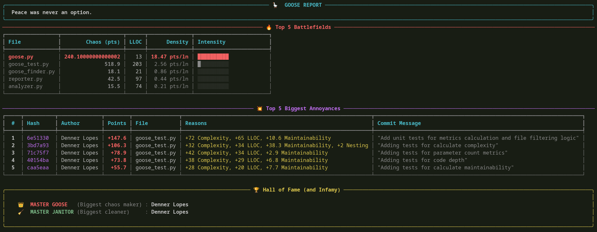

<div align="center">

<pre style="font-size: 10px; line-height: 12px;">
<small>
                                      ----------
                                  --=---::----:--=-
         ---======---::::::::::--=-.             .:---
       -=--:      .----::::::--:-.  ..............  .-=-
      --:   .......  :---::---:  ...................  :--
      .  ............  .--=-:. ....................... .--
         .............. --.  ..........................
 @@@@@: ...............  .............................. :-
 #@@@@: ..        ..................................... :-
-.            @@@@  ..................................... :-
 .-+%@@*=:=@@@@  ..................................... :-
-:  .*#*+=--=*-        ..................................... .-
 .%*------=-=#@ ..........................................:--
- +*----------=+- ........................................ .--
 =*==-----=+#@#  ......................................  --
 . .*+====+#=.  ..................................... .-=-
   .+##+.    .....................................  -=-
     .    .. .....................................  ---
          -....................................  ..=-.-..
         -:..................................  .-#-=-.*.-=.
         -:................................ .-*+-= -= +:-=.+
         -:. ...........................  :-::..:.::.-.::.-.
           -..........................  :%*..::.:.::.-.:..:.
          --: ......................  :*+*+-:-::=.--.=:-=.+.
           --:  .................  .=*@#*=:=.--:+.--.+:--.+
             ---:  ............  :--.     ...:..:....:....:.
              -:=-::            .::+.:::-.::.-.::.-.::.-.::.=.
             -=:=-:*-#++#=*++*=+=:=.--.+:--:=:-::+.--.+:-=:+.
              ..-:.-.-:.-.-::-.-:.=.--.-.-:.-.-::-.--.=.--.
                  .:.::.:.::.:.-..=.::.:.::.-.:..-.::.-.
                   =.-:.-.-::-.-:.-.::.-.::.-.::.-.::.=
                     -::=.-::-.-:.=:--.=.--:=:-::=.-=
                          -::-:-:.=:--.=:-::=.-:.
                             .::.::::::.::::.
</small>
</pre>

<p align="center">
  
  
  
  <a href="https://python.org"></a>
  <a href="https://github.com/your-username/goose-finder/issues"></a>
</p>

> *"Peace was never an option."*

# 🦆 Goose Finder

</div>

Inspired by [gitevo](https://github.com/gitevo), a CLI utility for creating repo insights.

Goose Finder is a CLI tool designed to hunt for "Annoyances" (code smells) in your Python repositories by analyzing the Git history. It identifies developers who increase code complexity and size (**Gooses**) and those who clean up the mess (**Janitors**). The theming of the tool is inspired by the great Untitled Goose Game.

### 🚀 Key features

#### Cost functions:
- **Complexity Tracking**: Uses cyclomatic complexity to detect when code becomes harder to maintain.
- **Size Analysis**: Tracks Logical Lines of Code (LLOC) to identify bloat.
- **Parameter Count**: Catches excessive use of parameters
- **Nested Code**: Tracks many nested blocks of code
- **Maintenability index**: Tracks ease of maaintaining code (Visual Studio methodology)
- **Any other you want, the code is extensible!**

#### Gives you a detailed and pretty visual report!
- **Top 5 Battlegrounds**: Identifies the most problematic files based on chaos density: the files with the highest chaos density.
- **Top 5 Annoyances**: Highlights the worst commits that introduced complexity or size.
- **Hall of Fame (and Infamy!)**: A leaderboard for the "Master Goose" (most chaos) and "Master Janitor" (most cleanup).


## Installation - Step-by-step setup guide

Just clone the project and install the requirements!

```bash
pip install -r requirements.txt
```

## 📖 Usage

Run the tool by providing the path to a local repository or a Git URL:

```bash
python goose_finder.py <path_to_repo_or_url> [options]
```

| Type | Command / Flag | Description |
| :--- | :--- | :--- |
| **Argument** | `<path_to_repo_or_url>` | The local path or Git URL of the repository to investigate. |
| **Option** | `-h, --help` | Shows help and a "honk" for you. |
| **Option** | `-v, --version` | Shows the current version of the tool. |


### Contributing

Thank you for your interest! Check [the contributing guide](CONTRIBUTING.md)

---

## Credits and thanks

We'd like to thank Andre Hora, for his GitEvo, which served for inspiration for this tool, and also gave us the assignment that this project stems from. It's been a lot of fun!

### Authors:
- Victor Gabriel Araujo Barbosa
- Denner dos Santos Lopes
- Felipe Dias de Souza Martins
- João Paulo Moura Furtado

*Developed to prove that peace was never an option in code review.*

